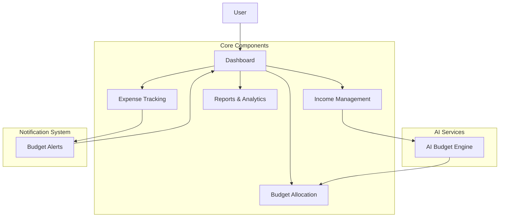

# 💰 BudgetAI - Smart Financial Management

<div align="center">


[](https://opensource.org/licenses/MIT)
[](https://reactjs.org/)
[](https://tailwindcss.com/)
[](https://www.typescriptlang.org/)

**✨ AI-Powered Budget Management Dashboard ✨**

</div>

## 🚀 Overview

BudgetAI is a cutting-edge financial management application that leverages artificial intelligence to provide personalized budget recommendations and insights. Built with modern web technologies, it offers a seamless and intuitive experience for managing personal finances.

## ✨ Key Features

- 🧠 **AI-Powered Recommendations** - Get intelligent budget allocations based on your income and spending patterns
- 📊 **Interactive Visualizations** - Track spending with beautiful, responsive charts and real-time updates
- 🔔 **Smart Alerts** - Receive timely notifications when approaching budget limits or unusual spending patterns
- 📱 **Fully Responsive** - Enjoy a perfect experience across desktop, tablet, and mobile devices
- 🌓 **Dark/Light Mode** - Choose your preferred theme for comfortable viewing in any environment
- 📈 **Detailed Reports** - Analyze your financial patterns with comprehensive reports and actionable insights
- 🔄 **Real-time Synchronization** - Keep your financial data up-to-date across all your devices
- 🔒 **Bank-level Security** - Rest easy knowing your financial data is protected with enterprise-grade encryption

## 🖥️ Screenshots

<div align="center">
  
  <p><em>Main Dashboard View</em></p>
  
  <br/>
  
  <div style="display: flex; justify-content: space-between;">
    
    
  </div>
  <p><em>Budget Allocation & Expense Tracking</em></p>
</div>

## 🛠️ Technical Stack

- **Frontend Framework**: React 18 with TypeScript for type-safe code
- **Styling**: Tailwind CSS for utility-first styling and responsive design
- **UI Components**: Shadcn UI for beautiful, accessible components
- **Data Visualization**: Recharts for responsive and customizable charts
- **Form Handling**: React Hook Form with Zod for validation
- **Icons**: Lucide React for consistent and scalable icons
- **Animation**: Framer Motion for smooth, physics-based animations
- **Date Handling**: date-fns for comprehensive date manipulation

## 🚀 Quick Start

```bash
# Clone the repository
git clone https://github.com/ahmed86-star/AI-Budgeting-Application.git

# Navigate to the project directory
cd AI-Budgeting-Application

# Install dependencies
npm install

# Start the development server
npm run dev
```

Visit `http://localhost:5173` to see the application running.

## 🏗️ Project Architecture



## 📊 Data Flow

1. 📥 User inputs monthly income and financial goals
2. 🧠 AI engine analyzes input and generates optimized budget allocations
3. 📊 Dashboard displays visualizations of budget categories and spending
4. 💸 User records expenses which are categorized automatically
5. 🔄 Budget remaining is updated in real-time
6. 🚨 Alerts are triggered when spending approaches category limits
7. 📈 Reports are generated to provide insights on spending patterns

## 🧩 Component Structure

- **Dashboard**: Central hub for all financial information
  - **Header**: Navigation and user profile
  - **FinancialOverview**: Summary of current financial status
  - **IncomeSection**: Income management and updates
  - **BudgetAllocation**: Category-wise budget distribution
  - **ExpenseTracker**: Record and categorize expenses
  - **SpendingCharts**: Visual representation of financial data
  - **BudgetAlerts**: Notifications for budget thresholds

## 🔧 Advanced Configuration

BudgetAI supports various configuration options to customize the experience:

- **Currency Settings**: Change display currency and formatting
- **Budget Categories**: Add, remove, or modify default budget categories
- **Alert Thresholds**: Customize when alerts are triggered (e.g., 80% of budget)
- **Report Frequency**: Set up weekly, bi-weekly, or monthly financial reports
- **Data Export**: Configure export options for financial data

## 🤝 Contributing

Contributions are welcome and appreciated! Here's how you can contribute:

1. 🍴 Fork the repository
2. 🌿 Create your feature branch (`git checkout -b feature/amazing-feature`)
3. 💻 Commit your changes (`git commit -m 'Add some amazing feature'`)
4. 📤 Push to the branch (`git push origin feature/amazing-feature`)
5. 🔄 Open a Pull Request

## 📝 License

This project is licensed under the MIT License - see the LICENSE file for details.

## 🙏 Acknowledgements

- [Shadcn UI](https://ui.shadcn.com/) for the beautiful UI components
- [Recharts](https://recharts.org/) for the responsive charts
- [Lucide Icons](https://lucide.dev/) for the elegant icons
- [Tailwind CSS](https://tailwindcss.com/) for the utility-first CSS framework
- [TypeScript](https://www.typescriptlang.org/) for the type safety
- [React Hook Form](https://react-hook-form.com/) for the form handling
- [Zod](https://zod.dev/) for the schema validation

## 📚 Documentation

For detailed documentation on how to use and extend BudgetAI, visit our [documentation site](https://ahmed-dev1.com/docs/budgetai).

---

<div align="center">
  <p>Built with ❤️ by <a href="https://github.com/ahmed86-star">Ahmed</a></p>
  <p>
    <a href="https://github.com/ahmed86-star">GitHub</a> •
    <a href="https://ahmed-dev1.com/">Website</a> •
    
  </p>
</div>
