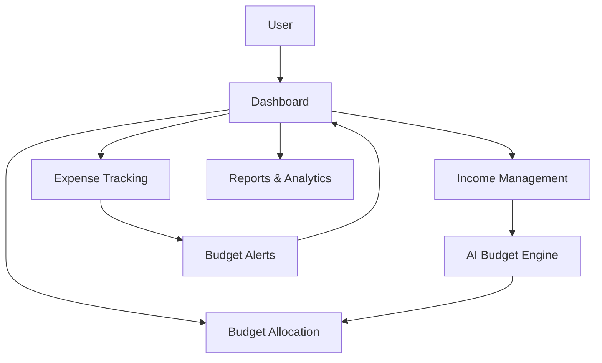

# 💰 BudgetAI - Smart Financial Management

<div align="center">


[](https://opensource.org/licenses/MIT)
[](https://reactjs.org/)
[](https://tailwindcss.com/)
[](https://www.typescriptlang.org/)

**AI-Powered Budget Management Dashboard**

</div>

## ✨ Features

- 🧠 **AI-Powered Recommendations** - Get intelligent budget allocations based on your income
- 📊 **Interactive Visualizations** - Track spending with beautiful, responsive charts
- 🔔 **Smart Alerts** - Receive notifications when you're approaching budget limits
- 📱 **Fully Responsive** - Perfect experience on desktop, tablet, and mobile
- 🌓 **Dark/Light Mode** - Choose your preferred theme for comfortable viewing
- 📈 **Detailed Reports** - Analyze your financial patterns with comprehensive reports

## 🖥️ Screenshots

<div align="center">
  
  <p><em>Main Dashboard View</em></p>
  
  <br/>
  
  <div style="display: flex; justify-content: space-between;">
    
    
  </div>
  <p><em>Budget Allocation & Expense Tracking</em></p>
</div>

## 🚀 Quick Start

```bash
# Clone the repository
git clone https://github.com/yourusername/budgetai.git

# Navigate to the project directory
cd budgetai

# Install dependencies
npm install

# Start the development server
npm run dev
```

Visit `http://localhost:5173` to see the application running.

## 🛠️ Technologies

- **Frontend**: React, TypeScript, Tailwind CSS
- **UI Components**: Shadcn UI
- **Charts**: Recharts
- **Form Handling**: React Hook Form
- **Icons**: Lucide React

## 🧩 Architecture



## 🤝 Contributing

Contributions are welcome! Please feel free to submit a Pull Request.

1. Fork the repository
2. Create your feature branch (`git checkout -b feature/amazing-feature`)
3. Commit your changes (`git commit -m 'Add some amazing feature'`)
4. Push to the branch (`git push origin feature/amazing-feature`)
5. Open a Pull Request

## 📝 License

This project is licensed under the MIT License - see the LICENSE file for details.

## 🙏 Acknowledgements

- [Shadcn UI](https://ui.shadcn.com/) for the beautiful UI components
- [Recharts](https://recharts.org/) for the responsive charts
- [Lucide Icons](https://lucide.dev/) for the elegant icons

---

<div align="center">
  <p>Built with ❤️ by <a href="https://github.com/ahmed86-star">Ahmed</a></p>
  <p>
    <a href="https://github.com/ahmed86-star">GitHub</a> •
    <a href="https://ahmed-dev1.com/">Website</a>
  </p>
</div>
